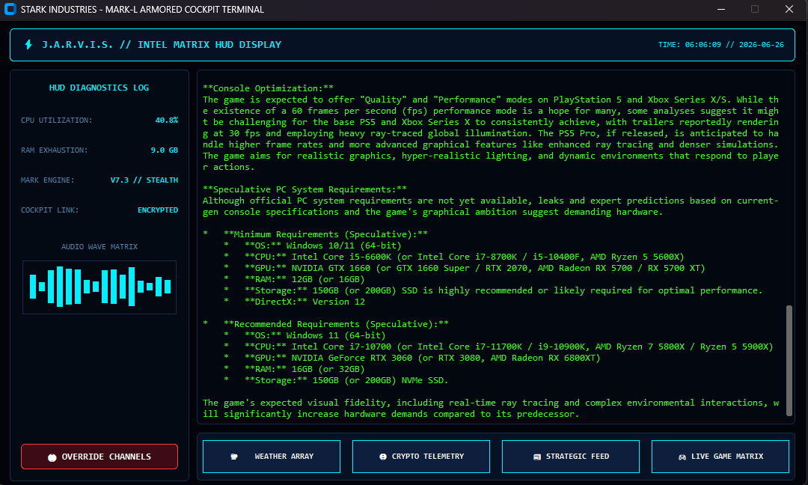

# ⚡ J.A.R.V.I.S. // MARK-L ARMORED COCKPIT TERMINAL
> **Operational Status:** `PRODUCTION_READY` | **Engine Build:** `V7.3 - STEALTH MOD` | **Classification:** `STARK INDUSTRIES HUD`

An advanced, independent tactical interface terminal designed to replicate the signature Iron Man Mark-L HUD cockpit aesthetics. Engineered utilizing a low-latency, multi-threaded framework, this system processes telemetry metrics from core hardware architectures, interprets incoming acoustic signals for neural routing, and deploys context-aware data arrays dynamically into an adaptive high-density display.

---

## 🖥️ Live Strategic HUD Display

Below is the execution state of the Mark-L Armored Interface running seamlessly on the Windows Desktop layer, fully optimized to map critical assets without taskbar clipping bugs:

---

## 🚀 Advanced Core Architectures & Feature Matrix

### 1. Adaptive Coordinates Window Geometry
* **Dynamic Resolution Interrogation:** Automatically queries host Windows screen parameters during initialization to gauge baseline bounds.
* **Taskbar Offset Mechanics:** Self-calculates safe-zone anchors to prevent bottom control panels from bleeding underneath custom taskbars, eliminating manual window drag operations.

### 2. Live Telemetry & System Infrastructure Health
* **Continuous Micro-Polling:** Monitors real-time CPU Utilization levels and active RAM Exhaustion profiles utilizing high-speed hardware interrogation routines.
* **System Heartbeat Integrity:** Provides persistent indicators for thread status, engine compile builds, and localized clock tracking routines.

### 3. Audio Wave Matrix & Multi-Thread Execution
* **Visual Data Canvas:** An active, multi-point visualizer that dynamically generates random frequency wave distributions to simulate voice channel tracking.
* **Silent Process Forking:** Fully pathed with custom Windows execution creation flags (`subprocess.CREATE_NO_WINDOW`) to completely trap and hide redundant console pop-up spawns.

### 4. Neural Intent Routing Engine (Powered by Gemini 2.5 Flash)
* **Acoustic Staging Pipelines:** Isolates external auditory command triggers and pushes compressed audio payloads directly to high-capacity cloud models.
* **Strategic Intent Handlers:** Segregates incoming instructions into strict context vectors for instant, fast macro executions:
    * `WEATHER_ROUTE` — Intercepts latitude/longitude telemetry coordinates to output true external surface atmospheric metrics.
    * `CRYPTO_ROUTE` — Queries decentralized global ledgers for asset evaluations (Bitcoin, Ethereum, XRP) and total capitalization metrics.
    * `NEWS_ROUTE` — Synchronizes high-relevance global summaries backed by strict Google Search Grounding pipelines.
    * `GAMING_ROUTE` — Aggregates deep-dive developer pipeline insights regarding production constraints, hardware optimization benchmarks, and upcoming PC port milestones for Grand Theft Auto 6 (GTA 6).

---

## 🛠️ Integrated Core Component Stack

* **Front-End Matrix:** `CustomTkinter` & `Tkinter Canvas` (Custom High-Contrast Cyber Palette)
* **System Metrics Ingestion:** `psutil` (Kernel metrics tracking)
* **Audio Staging Arrays:** `sounddevice`, `scipy.io.wavfile`, `SpeechRecognition`
* **Cognitive Processing Layer:** `google-genai SDK` (Direct integration with state-of-the-art LLMs)
* **Binary Compiler Pipeline:** `PyInstaller` (Binary stream extraction, asset embedding)

---

## 📦 Independent Deployment Guide

This repository delivers a fully compiled, isolated release build of the Jarvis HUD system, requiring zero external Python environment configurations or local package dependencies.

### How to Run:
1. Download or clone this repository package branch.
2. Locate and open the main release folder (`dist/JARVIS_Mark_L`).
3. Launch **`JARVIS_Mark_L.exe`** to initialize the desktop cockpit environment.

*Note: Ensure your operating system allows network access for real-time model requests and micro-microphone ingestion for verbal phrase mapping.*